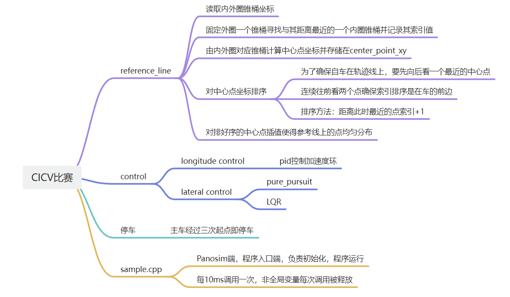
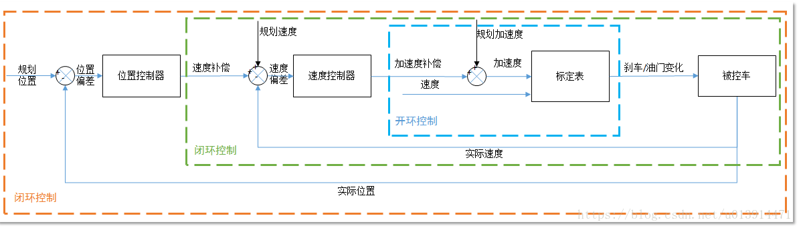



<!-- PROJECT LOGO -->
 

  <!--  -->

  <h1 align="center">CICV2022仿真赛题1-大学生方程式赛车</h1>

  

    <!--   -->
    <!-- <a href="https://github.com/othneildrew/Best-README-Template"><strong>Explore the docs »</strong></a>
      -->
     
    <a href="https://www.bilibili.com/video/BV1Xv4y197wV/?spm_id_from=333.999.0.0&vd_source=b7830616317d04289db089c940d49514">View video Demo</a>
    ·
    <a href="https://github.com/yizhiweimengxiangfendoudefeifei/cell/issues">Report Bug</a>
    ·
    <a href="https://github.com/yizhiweimengxiangfendoudefeifei/cell/pulls">Request Feature</a>
     
  

<!-- ABOUT THE PROJECT -->
## About CICV2022 仿真赛
本项目为CICV2022仿真赛题1-大学生方程式赛车。  
项目需要识别两侧红蓝桩桶，生成参考线，控制车辆竞速完成比赛。决赛地图包含多个发卡弯，U型弯，大直道，需要良好的横纵向结合能力方能完成比赛。  
在这里很感谢CICV比赛承办方和Panosim平台，感谢团队成员的共同努力，最终我们取得全国第一的成绩。
仿真平台为Panosim，程序编译使用vs2019。  
[决赛视频](https://www.bilibili.com/video/BV1Xv4y197wV/?spm_id_from=333.999.0.0&vd_source=b7830616317d04289db089c940d49514)

<!-- GETTING STARTED -->
## Getting Started

### Prerequisites

Simply perform the following steps：

* eigen

  [安装Eigen3](http://eigen.tuxfamily.org/index.php?title=Main_Page)
  
<!-- USAGE EXAMPLES -->
### 代码框架
  
### 编译运行
    在vs2019上进行编译，编译生成的dll文件位于相对文件夹\Sample\SampleSchedulerNode\bin\x64\Release\SampleScheduler_142.dll。
    生成的dll文件拷贝到Panosim工作目录D:\PanoSimDatabase\Plugin\Agent中即可。

### Result
通过比赛调试，掌握了纯跟踪和LQR横向控制方法，对PID调参有了更深的认识。 
 
#### LQR理解
目标函数为：
$J=e_{rr}^{T}Qe_{rr}+u^{T}Ru$，目标函数此二次型在约束$\dot e_{rr}=Ae_{rr}+Bu$下存在最小值。

将代价函数化简为：

$$
J=[e_d,\dot e_d,e_{\varphi},\dot e_{\varphi}]
\begin{bmatrix}
Q_{11}&0&0&0\\
0&Q_{22}&0&0\\
0&0&Q_{33}&0\\
0&0&0&Q_{44}
\end{bmatrix}
\begin{bmatrix}
e_{d}\\
\dot e_{d}\\
e_{\varphi}\\
\dot e_{\varphi}
\end{bmatrix}+
u[R]u^{T}
$$

Q11：对应横向误差分析，值越大横向误差越小，反之相反。  
Q22：值变化不大，一般取较小值，比如1。  
Q33：对应航向误差分析，值越大航向误差越小，反之相反。  
Q44：值变化不大，一般取较小值，比如1。  
R：越大控制越小，不容易过急弯；越小控制越大，容易过急弯，控制不稳定。

#### 纯跟踪设计

1. 车辆在行驶过程中需要预瞄道路上的一点来计算转角。
2. 推导过程：  
在三角形OAC中应用正弦定理：  
$\frac{l_d}{\sin(2\alpha)}=\frac{R}{\sin\frac{(\pi-2\alpha)}{2}}$，
化简为：$\sin(\alpha)=\frac{l_d}{2R}(1)  
\tan\delta=\frac{L}{R}$，化简为：$\delta =\arctan\frac{L}{R}(2)$  
联立（1）和（2）得：  
$\delta=\arctan\frac{2Lsin\alpha}{l_d}$，
其中 $\alpha$ 为：$\alpha=\arctan\frac{y_c-y_A}{x_c-c_A}$  
其中Ld为预瞄距离，R为转弯半径，$\delta=\alpha$。  
纯跟踪近似为**比例控制器**，推导如下：  
横向误差$e_y=l_d*sin\alpha=\frac{l_d^2}{2L}tan\delta=\frac{l_d^2}{2L}\delta$  
所以纯跟踪本质上是一个比例控制器，跟踪效果由$\frac{l_d^{2}}{2L}$决定，通常定义ld为关于速度的一次多项式。

#### PID调参
时域表达$u(t)=u_P(t)+u_I(t)+u_D(t)=K_Pe(t)+K_I\int e(t)dt+K_D\frac{de(t)}{dt}$
双环PID是对位置和速度误差进行设计。
    
调参注意事项：
Kp：一般情况下不用太大就可以得到较好的收敛速度和精度。  
Ki：加快收敛速度，会带来超调，一般比Kp要小。  
Kd：减小静差。

<!-- ACKNOWLEDGMENTS -->
## Acknowledgments

比赛能够完成还要感谢我的队友们，他们都很给力！
* [JR-Rong](https://github.com/JR-Rong)
* [rogueyan5](https://github.com/rogueyan5)
* [yunqilingzhen](https://github.com/yunqilingzhen)
* [JR-Rong](https://github.com/JR-Rong)
* [clzls](https://github.com/clzls)